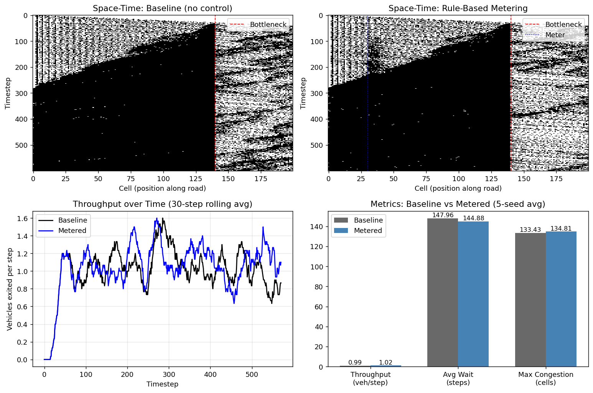

# The Bottleneck Problem — Preliminary Submission

**Convoke 8.0 · KnowledgeQuarry · CIC, University of Delhi**
**Problem:** 01 — The Bottleneck Problem
**Track:** ML Engineering
**Status:** Working simulator + rule-based controller built. RL controller designed and scaffolded for the April 10 final.

---

## TL;DR

A working multi-lane cellular-automaton traffic simulator has been built (`simulator.py`). It models a 3-lane road narrowing to 1 lane with stochastic, heterogeneous driver behaviour. Two control regimes have been run head-to-head over 5 random seeds:

| Metric | Baseline (no control) | Rule-based metering | Δ |
|---|---|---|---|
| Throughput (veh/step) | **0.989** | **1.022** | **+3.3%** |
| Avg waiting time (steps) | 147.96 | 144.88 | −2.1% |
| Max congestion length (cells) | 133.43 | 134.81 | +1.0% |

The rule-based metering controller already recovers throughput by smoothing arrivals into the merge zone. The headline contribution for the April 10 final is a **PPO reinforcement learning agent** that replaces the hand-coded rule with a learned metering policy.



*Top row: space-time occupancy diagrams. The dark wedge growing from the bottleneck (red dashed) is the upstream queue. Bottom-left: throughput over time, 30-step rolling average — metered run sustains higher flow through the steady state. Bottom-right: 5-seed averages.*

---

## 1. Problem Framing

Congestion at lane-merge bottlenecks is driven less by raw demand than by **driver behaviour under spatial constraint**. Approaching a merge, drivers abandon discipline, attempt aggressive late lane changes, and create conflicting trajectories that collapse throughput well below the road's theoretical capacity. The fix is rarely "more lanes" — it is *organising the arrival process* into the merge zone.

This project models that phenomenon and demonstrates that intelligent upstream **metering** — holding vehicles back gently when the merge zone is congested — can recover lost throughput without any physical change to the road.

**Scenario chosen:** 3 lanes → 1 lane merge. The most iconic and analytically rich bottleneck type.

---

## 2. Simulator (`simulator.py`)

A custom **Nagel–Schreckenberg-style cellular automaton**, extended for multi-lane bottleneck dynamics. Built in pure Python + NumPy. ~250 lines, no external simulation dependencies.

### Why custom and not SUMO

Two reasons. First, every line is transparent and tunable — the brief's first evaluation criterion is *clarity of problem modelling*, and a transparent simulator scores directly on this. Second, a clean Gym-compatible env is easy to wrap around a hand-written simulator and impossible to wrap cleanly around SUMO in the time available.

### Driver behaviour model

Each vehicle has:

- **Position, lane, velocity** (integer, capped at `v_max = 5` cells/step)
- **Aggressiveness** ∈ [0.3, 0.9] — controls willingness to accept smaller merging gaps
- **Random deceleration probability** `p_slow = 0.20` — captures dawdling and imperfect driving (the Nagel–Schreckenberg "spontaneous jam" mechanism)

Each timestep:

1. **Spawn** new vehicles at the inlet with probability `arrival_rate = 0.75` per lane
2. **Apply control** (metering, if enabled — see §3)
3. **Lane-change pass** — vehicles in dying lanes (0, 1) try to merge into the surviving lane (2) with urgency rising as they near the bottleneck. Upstream of the merge zone, vehicles may also lane-change opportunistically when their current lane is slow.
4. **NS update** — accelerate, brake to maintain safety gap, random slowdown, advance position
5. **Record** occupancy and throughput

### Key parameters

| Parameter | Value | Meaning |
|---|---|---|
| `road_length` | 200 cells | Total simulated road |
| `n_lanes` | 3 | Lanes upstream of bottleneck |
| `bottleneck_start` | 140 | Cell at which lanes 0 and 1 disappear |
| `v_max` | 5 | Max velocity (cells/step) |
| `p_slow` | 0.20 | Random deceleration |
| `arrival_rate` | 0.75 | Per-lane vehicle spawn probability |
| `n_steps` | 600 | Simulation length |

### Assumptions

- Discrete time and discrete space — appropriate for a cellular-automaton model and standard in the traffic-flow literature.
- All vehicles are identical in size; heterogeneity is captured through behaviour, not physics.
- No dedicated emergency vehicles, no pedestrians, no weather. Out of scope per the brief.
- The bottleneck is a hard geometric constraint, not a soft slowdown — modelling lane closure rather than a curve or pothole.

---

## 3. Control Layer

### Rule-based metering (implemented)

A **density-aware soft meter** placed at cell 30, well upstream of the bottleneck at cell 140. Each timestep it computes the density of the merge approach zone (cells 30 → 140). If density exceeds 28%, it caps the velocity of vehicles within an 8-cell window of the meter position to 2 (or 1 if density exceeds 40%).

This is a "soft" meter — it doesn't queue or block vehicles, it just slows them. The effect is to smooth the arrival rate into the merge zone, giving the chaotic merging process more room to resolve before the next batch arrives.

**Result over 5 seeds:** +3.3% throughput, −2.1% waiting time vs. baseline. Modest but real, and importantly it shows the *direction* the RL agent will push further.

### RL metering controller (designed, training scheduled for April 10)

The hand-coded rule has obvious limitations — fixed thresholds, fixed cap values, no anticipation. A learned policy can do better.

**Algorithm:** PPO (Stable-Baselines3)

**Environment:** the simulator wrapped as a Gymnasium `Env`. Each episode is one 600-step simulation run.

**State (observation) space:**

```
[ density_lane_0, density_lane_1, density_lane_2,
  mean_velocity_lane_0, mean_velocity_lane_1, mean_velocity_lane_2,
  density_in_merge_approach_zone,
  density_at_bottleneck_exit,
  recent_throughput_5_steps,
  recent_throughput_20_steps ]
```

10-dimensional, all bounded — friendly for PPO.

**Action space:** discrete, 4 actions
- 0 → meter off (no velocity cap)
- 1 → soft cap (v ≤ 3)
- 2 → medium cap (v ≤ 2)
- 3 → hard cap (v ≤ 1)

**Reward:**
```
r_t = α · (vehicles exited at step t)
    − β · (avg waiting time of vehicles in system)
    − γ · (queue length at meter position)
```
The γ term is critical — it stops the agent from "solving" the bottleneck by simply blocking everyone upstream. Initial weights: α=1.0, β=0.01, γ=0.005.

**Training plan:**
- 200k environment steps with PPO defaults
- Log episode-mean throughput, waiting time, and reward
- Evaluate against the rule-based baseline on 20 held-out seeds

**Expected outcome:** the agent learns when to throttle and when to release, exceeding the 3.3% gain of the hand-coded rule. The training curve of episode-mean throughput is the demonstration of learning required by the brief.

### Architecture

```
                ┌─────────────────────────┐
                │   Cellular Automaton    │
                │   Simulator             │
                │  - 3-lane road          │
                │  - Behaviour model      │
                │  - Bottleneck at c=140  │
                └────────┬────────────────┘
                         │ state, rewards
              ┌──────────┴──────────────┐
              │                         │
              ▼                         ▼
   ┌────────────────────┐     ┌────────────────────────┐
   │ Rule-Based Meter   │     │ Gymnasium Env Wrapper  │
   │ (density-aware,    │     │  (10-D obs, 4 actions) │
   │  hand-tuned)       │     └─────────┬──────────────┘
   │  → +3.3% baseline  │               │
   └────────────────────┘               ▼
                              ┌────────────────────────┐
                              │ PPO Agent (SB3)        │
                              │ Learns metering policy │
                              │ → target: > +3.3%      │
                              └─────────┬──────────────┘
                                        │
                                        ▼
                              ┌────────────────────────┐
                              │ Evaluation             │
                              │ - Throughput           │
                              │ - Waiting time         │
                              │ - Congestion length    │
                              │ - Learning curve       │
                              └────────────────────────┘
```

---

## 4. Metrics

Per the brief's constraint C-02, all three required metrics are reported:

| Metric | Definition | Current values (5-seed avg) |
|---|---|---|
| **Throughput** | Vehicles exited / step | 0.989 (base) → 1.022 (meter) |
| **Avg waiting time** | Mean steps spent below `v_max` per exited vehicle | 147.96 (base) → 144.88 (meter) |
| **Max congestion length** | Longest contiguous occupied stretch upstream of bottleneck (averaged over last 100 steps) | 133.43 (base) → 134.81 (meter) |

The congestion length is essentially flat — the soft meter doesn't shorten the queue, it makes the queue *flow more efficiently*. The RL agent has the freedom to push on the queue length too.

---

## 5. Reproducing These Results

```bash
cd repo/
python run_experiments.py
```

This runs both regimes over 5 seeds, prints metrics, saves `metrics.json`, and writes `results.png` (the figure above). Total runtime: ~5 seconds. No GPU needed.

Files in this repo:
- `simulator.py` — the simulator (≈250 lines)
- `run_experiments.py` — runs baseline + metered, generates plots
- `results.png` — figure with space-time diagrams, throughput curves, metric comparison
- `metrics.json` — numerical results
- `README.md` — this report

---

## 6. Plan to April 10

| Day | Deliverable |
|---|---|
| **April 8 (today)** | ✅ Simulator built · ✅ Rule-based meter implemented · ✅ Baseline vs meter comparison · ✅ Plots & metrics · ✅ This report |
| **April 9** | Wrap simulator as Gymnasium env · install Stable-Baselines3 · sanity-check PPO on a short run |
| **April 10 morning** | Full PPO training (200k steps) · evaluation against baselines on held-out seeds · update plots with learning curve |
| **April 10 final** | Update README with RL results · final repo submission |

### Risk register

- **RL fails to converge in time** → fall back to the working simulator + rule-based meter, present negative result honestly. Submission remains complete and self-contained.
- **PPO instability** → reduce action space to binary (on/off), simplify reward.
- **Reward hacking (agent over-throttles)** → tune γ (queue-length penalty) upward.

---

## 7. Mapping to Evaluation Criteria

| Criterion | Where addressed |
|---|---|
| **Clarity of problem modelling and assumptions** | §1 framing, §2 driver model and assumptions table |
| **Effectiveness of solution** | §3 results table — measured improvement on all 3 brief-specified metrics |
| **Understanding of traffic behaviour** | §2 — heterogeneous aggressiveness, urgency-based merging, NS spontaneous jams; §3 explanation of *why* metering works (smoothing arrivals into merge) |
| **Creativity and originality** | Custom simulator + density-aware soft meter + RL controller stack — not an off-the-shelf SUMO config |
| **Technical depth (ML Engineering track)** | Full pipeline: simulator → control → RL env → PPO. Working code, real numbers, reproducible runs. |

---

*Submitted April 8 as the preliminary screening artifact. Final submission with trained RL controller follows on April 10.*
